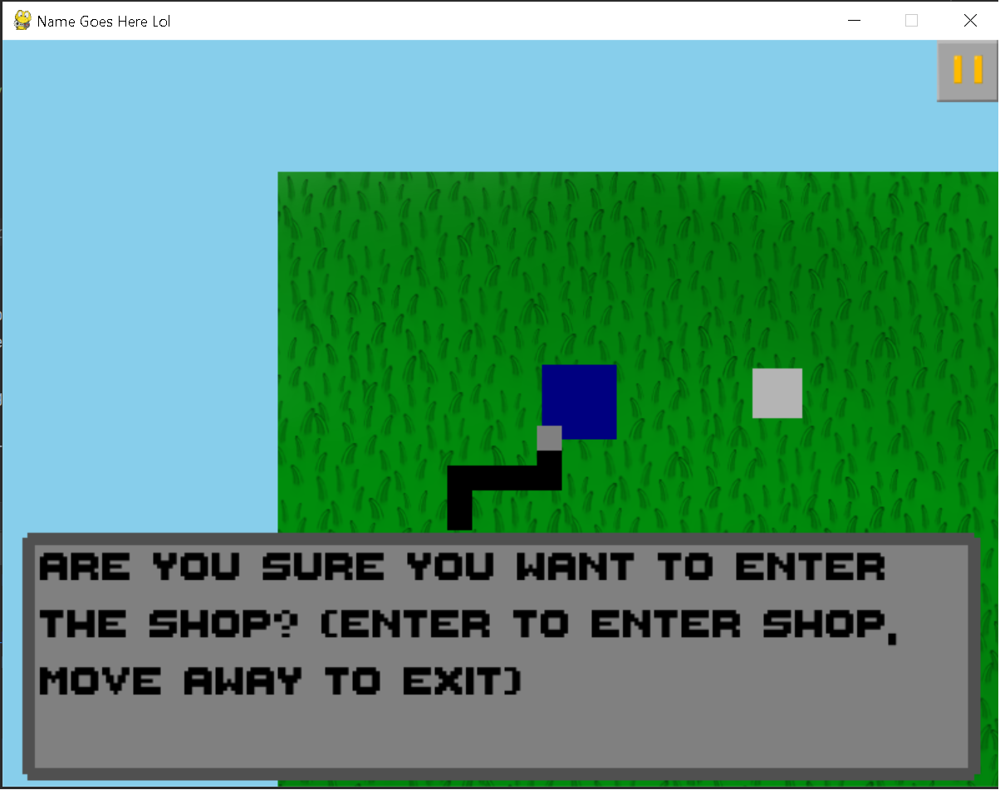

[](https://www.codacy.com/gh/SSS-Says-Snek/name_goes_here_lol/dashboard?utm_source=github.com&amp;utm_medium=referral&amp;utm_content=SSS-Says-Snek/name_goes_here_lol&amp;utm_campaign=Badge_Grade)

[](https://lgtm.com/projects/g/SSS-Says-Snek/name_goes_here_lol/context:python)
[](https://lgtm.com/projects/g/SSS-Says-Snek/name_goes_here_lol/alerts/)

Title's kinda misleading, it's just Snake+ (upgraded version of snake, I had nothing to do, ok? I just wanted to improve my pygame skillz, as they were nonexistant)

Right now, Snake+ should just be an upgraded version of snake, with progress, **ENEMIES**, and fun. Not good at working with classes, so if you look at my code it's gonna look like trash... Not that my code without classes is good, kek. This is also my first time making a semi-original idea in pygame, so some ideas will suck.

Only menu's functioning rn lol
And a semi-playable snake game :kekw:

## Features
Well, we got this menu...

And now we have a *semi-playable* game (I said semi playable because the collision sucks so much)


## How to install
1. Download the repository and extract it to a folder
2. CD into the extracted folder
3. Execute the following script in your terminal:
   ```shell script
   python -m pip install -r requirements.txt
   ```
   NOTE: If you are on another OS than Windows, you should run:
   ```shell script
   python3 -m pip install -r requirements.txt
   ```
4. Run the game with
   ```shell script
   python main.py
   ```
   NOTE: Again, if you're not on Windows, you should run:
   ```shell script
   python3 main.py
   ```
NOTE: Right now, you have to have python 3.6 or above to run the game. There is no executables right now, because I suck at pyinstaller lel
## Todo and Checklists

- [X] Added bare bones for menu
- [X] Actually add the game
- [ ] Implement actual game mechanics
- [ ] Implement settings button in main menu
- [ ] Make debug screen more asthetically pleasing
- [ ] Implement saving and loading system
- [ ] Add actually good graphics
- [ ] Add shopping system for engaging gameplay
- [ ] Because of shopping system, scoring system should be in game currency
- [ ] Add a high score system (preferably switchable between local and overall)
- [X] Make collision detection between player and food better
